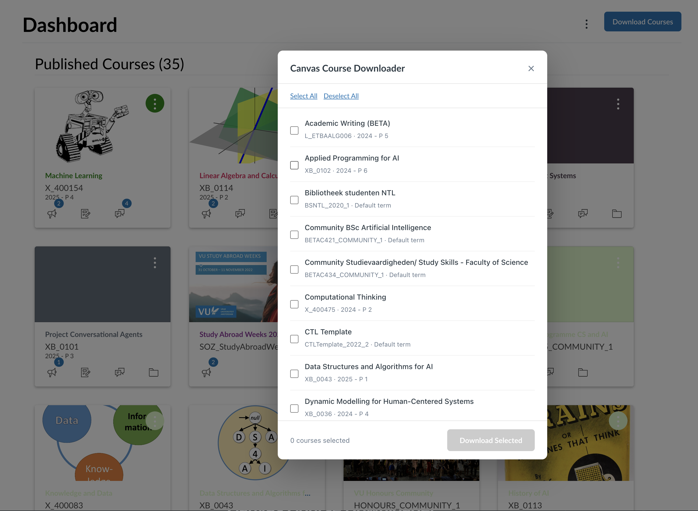

<p align="center">
  
</p>

<h1 align="center">Canvas Course Downloader</h1>

<p align="center">
  <strong>A free, open-source browser extension that bulk-downloads everything from your Canvas LMS courses with one click.</strong><br>
  <sub>Works on Chrome, Edge, Firefox, Brave, and all Chromium-based browsers.</sub>
</p>

<p align="center">
  <a href="#features">Features</a> &nbsp;&bull;&nbsp;
  <a href="#installation">Installation</a> &nbsp;&bull;&nbsp;
  <a href="#usage">Usage</a> &nbsp;&bull;&nbsp;
  <a href="#supported-content">Supported Content</a> &nbsp;&bull;&nbsp;
  <a href="#contributing">Contributing</a>
</p>

---

## The Problem

When a semester ends, your Canvas courses can disappear. Downloading files one by one is painfully slow — especially when you have hundreds of files across dozens of courses. Existing tools require API tokens, Python scripts, or command-line knowledge.

## The Solution

**Canvas Course Downloader** is a zero-config browser extension for Chrome, Edge, Firefox, and Brave. Navigate to Canvas, click a button, and every file, page, assignment, announcement, discussion, module, and syllabus gets downloaded into neatly organized folders. No API keys. No setup. It just works.

## Features

- **One-Click Download** — download all content from any Canvas course page
- **Bulk Download** — select multiple courses from your dashboard and download them all at once
- **Deep File Extraction** — finds files linked inside assignments, pages, announcements, and discussions that are normally hidden from the file browser
- **Organized Folder Structure** — files are saved in `Files/`, `Pages/`, `Modules/`, and `Extracted_Files/` subfolders per course
- **Works Everywhere** — supports any Canvas LMS instance (Instructure-hosted or self-hosted), on macOS, Windows, and Linux
- **No API Keys Required** — uses your existing Canvas session, so there's nothing to configure
- **Privacy First** — runs entirely in your browser. No data is ever sent to external servers

## Screenshots

### Bulk Download Result
All courses neatly organized into folders:


### Multi-Course Selector
Select which courses to download directly from your Canvas dashboard:



## Installation

### Chrome / Edge / Brave (Developer Mode)

1. Clone this repository:
   ```bash
   git clone https://github.com/jasp-nerd/canvas-course-downloader.git
   ```
2. Open your browser's extension page:
   - **Chrome:** `chrome://extensions`
   - **Edge:** `edge://extensions`
   - **Brave:** `brave://extensions`
3. Enable **Developer mode** (toggle in the top-right corner)
4. Click **Load unpacked** and select the cloned folder
5. Navigate to your Canvas LMS site — the extension is ready to use

### Firefox (Developer Mode)

1. Clone this repository
2. Open `about:debugging#/runtime/this-firefox`
3. Click **Load Temporary Add-on** and select the `manifest.json` file
4. Navigate to your Canvas LMS site

### Web Stores

*Coming soon for Chrome Web Store and Firefox Add-ons.*

## Usage

### Download a Single Course

1. Navigate to any Canvas course page
2. Click the **"Download Course Content"** button that appears in the breadcrumb bar
3. The extension fetches all content and downloads it into organized folders

### Download Multiple Courses

1. Go to your Canvas dashboard (homepage)
2. Click **"Download Courses"** in the header
3. Select the courses you want to download
4. Click **"Download Selected"** and watch the progress bar

## Supported Content

| Content Type   | What Gets Downloaded                                         |
| -------------- | ------------------------------------------------------------ |
| Files          | All files from the course file browser, organized by folder  |
| Pages          | Every page saved as an HTML file                             |
| Assignments    | All assignments with descriptions and due dates              |
| Announcements  | All course announcements with dates                          |
| Discussions    | Discussion topics with author info                           |
| Modules        | Module structure + any files linked within modules           |
| Syllabus       | The course syllabus as HTML                                  |
| Hidden Files   | Files embedded in assignments, pages, or announcements       |

## Project Structure

```
canvas-course-downloader/
├── manifest.json      # Extension manifest (MV3 — Chrome, Edge, Firefox)
├── content.js         # Content script — Canvas detection, API calls, UI overlay
├── background.js      # Service worker — sequential download queue
├── popup.html         # Extension popup UI
├── popup.js           # Popup logic — communicates with content script
└── icons/
    └── icon.svg       # Extension icon
```

## How It Works

1. **Detection** — The content script checks if the current page is a Canvas LMS site by looking for Instructure domains and Canvas-specific DOM elements
2. **API Calls** — It uses the Canvas REST API with the user's existing session cookies (no API token needed) and handles pagination automatically
3. **File Discovery** — Beyond the standard file list, it parses HTML content from pages, assignments, and announcements to find linked files that aren't in the file browser
4. **Download Queue** — Files are sent to the background service worker, which downloads them sequentially with throttling to avoid overwhelming the browser

## Contributing

Contributions are welcome! Please see [CONTRIBUTING.md](CONTRIBUTING.md) for guidelines.

Some ideas for contributions:
- Chrome Web Store / Firefox Add-ons listing
- Download progress notifications
- Configurable download options (e.g., skip certain content types)
- Improved file deduplication

## License

[MIT](LICENSE) — use it however you want.
